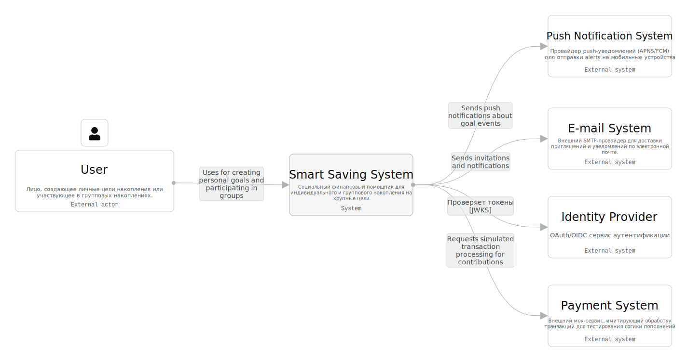
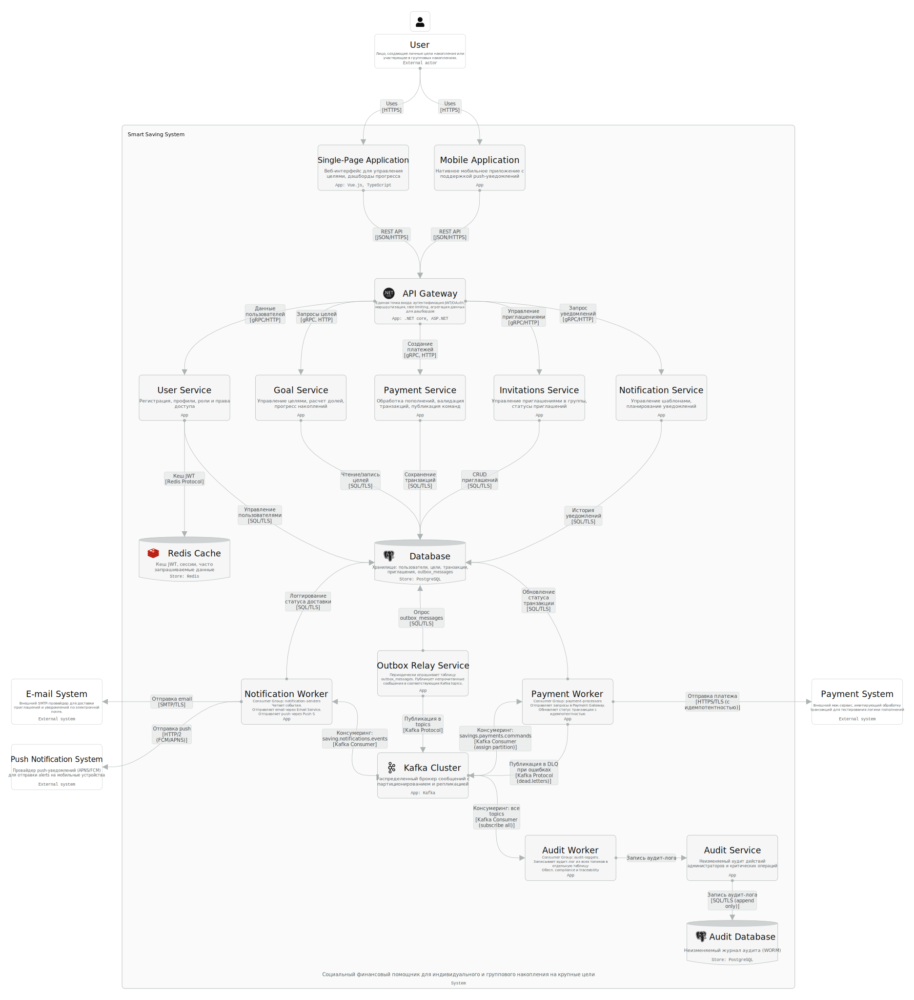

# SmartSavingsHub

Социальный финансовый помощник для коллективного и индивидуального накопления на крупные цели.

> *"Людям тяжело копить на крупные покупки. Одиночество в этом процессе демотивирует, а контроль общих сборов - головная боль."*

SmartSavingsHub призван решить эту проблему, объединяя людей общими целями и автоматизируя учет. Платформа позволяет копить как индивидуально, так и в группах, обеспечивая прозрачность, контроль и мотивацию на каждом этапе. Этот документ описывает архитектурное видение проекта.

---

## Содержание

1.  [Бизнес-кейс](#бизнес-кейс)
2.  [Системные требования](#system-requirements)
    - [Заинтересованные стороны (Stakeholders)](#stakeholders-заинтересованные-стороны)
    - [Роли пользователей](#роли-пользователей)
    - [Матрица интересов (Stakeholder-Concern Matrix)](#матрица-интересов-stakeholder-concern-matrix)
    - Ключевые архитектурные конфликты (Trade-offs) - ?
    - [Функциональные требования](#функциональные-требования-uc)
    - [Архитектурные характеристики](#архитектурные-характеристики-nfrqa)
3.  [Целевая архитектура](#целевая-архитектура)
    - [Контекст системы](#контекст-системы-system-context)
    - [Контейнеры (C4)](#контейнеры-c4)
    - [Ключевые процессы](#ключевые-процессы)
4.  [Переходная архитектура и критерии эволюции](#переходная-архитектура-и-критерии-эволюции)
5.  [Архитектурные решения (ADR)](#архитектурные-решения-adr)

--- 

## Бизнес-кейс

**Проблема:** Существующие банковские и финансовые приложения ориентированы на индивидуальные счета. Групповое накопление (на подарки, путешествия, крупные покупки) вынуждает людей использовать ручные инструменты, где теряется прозрачность ("кто сколько внес"), возникают споры и падает мотивация.

**Бизнес-цель:** Создать платформу, которая станет "социальным слоем" над финансами. На первом этапе - симуляция транзакций для отработки модели и набора аудитории. В перспективе - интеграция с реальными платежными системами (СБП, банковские карты) с монетизацией через комиссию за вывод средств или премиум-доступ.

## System Requirements

### Stakeholders (Заинтересованные стороны)

В этом разделе описываются ключевые заинтересованные стороны системы и их архитектурные интересы.

* **SH-1**: Пользователь платформы (приватность, безопасность, корректность данных, простота использования)
  - Это физическое лицо, которое использует сервис для накопления средств - как индивидуально, так и в группах.
  - Пользователь ожидает, что его персональные данные (имя, email) будут надежно защищены и не станут доступны постронним.
  - Ему важно, чтобы баланс целей отображался корректно, а все операции по пополнению учитывались без ошибок.
  - Пользователь хочет получать уведомления о событиях в группах, но не быть при этом спамом.
* **SH-2**: Администратор платформы (отказоустойчивость, масштабируемость, наблюдаемость, аудит)
  - Это технический специалист или команда, отвечающая за стабильную работу платформы, ее безопасность и эксплуатацию.
  - Админимтратору нужны инструменты для мониторинга состояния системы, отслеживания ошибок и анализа производительности.
  - Он должен иметь возможность расследовать инциденты, опираясь на неизменяемые логи аудита.
  - Администратор отвечает за масштабирование системы при росте нагрузки и обеспечение ее отказоустойчивости
* **SH-3**: PM. Менеджер продукта (расширяемость, гибкость настроек)
  - Это роль, отвечающая за развитие функциональности платформы и достижение бизнес-метрик.
  - Менеджеру продукта необходимы данные о том, как пользователи используют сервис: сколько целей создают, как часто пополняют, насколько эффективны уведомления.
  - Ему важна возможность быстро добавлять новые "мотивационные" фичи (челленджи, бейджи, поздравления) без риска сломать существующую логику учета средств.
  - Продукту нужна гибкость в настройке бизнес-правил (например, лимитов на количество участников в группе).
* **SH-4**: Служба поддержки (инструменты просмотра данных, история операций, аудит действий)
  - Это сотрудники, которые помогают пользователям решать проблемы: отвечают на вопросы, разрешают спорты, восстанавливают доступ.
  - Им нужен удобный интерфейс для просмотра данных аккаунта и истории операций пользователя (но с ограничениями, чтобы не нарушать приватность других)
  - Службе поддержки важно видеть контекст спора: кто, когда и сколько внес, чтобы принимать объективные решения.
* **SH-5**: Регулятор (соответствие законам, право на забвение, хранение данных)
  - Это не прямое лицо, а собирательный образ законодательных требований (GDPR, 152-ФЗ и 115-ФЗ)
  - Система обязана обеспечивать защиту персональных данных (PII) и предоставлять пользователю возможность потребовать удаления всех данных о себе ("право на забвение").
  - Регулятор требует прозрачности того, как и где хранятся данные граждан.
* **SH-6**: Провайдер идентификации (Identity Provider) (безопасность аутентификации, управление токенами)
  - Это внешняя или внутренняя система, отвечающая за аутентификацию пользователей (подтверждение, что пользователь - это тот, за кого себя выдает).
  - IdP должен гарантировать безопасность процесса входа, защиту от компрометации учетных записей и корректную работу с токенами (JWT).
  - От его надежности зависит безопасность всей платформы: если IdP скомпрометирован, злоумышленник получит доступ к чужим аккаунтам и деньгам.
* **SH-7**: Платежный партнер (PSP) (безопасность транзакций, идемпотентность, надежность API) - учитывается для обеспечения расширяемости, на этапе MVP требования не предъявляет
  - Это внешний провайдер (банк, платежный шлюз), который будет обрабатывать реальные денежные переводы в будущих фазах проекта.
  - Партнер требует от системы строгого соблюдения стандартов безопасности (PCI DSS) при работе с платежными данными.
  - Для корректной работы необходима поддержка идемпотентности, чтобы повторная отправка одного и того же запроса не привела к списанию денег дважды.
  - Партнер ожидает от системы высокой надежности и доступности API для обмена данными о транзакциях.
 
---

### Роли пользователей

Один пользователь (SH-1) может выступать в разных ролях в зависимости от контекста.

| Роль | Когда возникает | Права и возможности | Особые архитектурные интересы |
| :-- | :-- | :-- | :-- |
| **Владелец цели** | Создает личную или групповую цель | Полное управление целью (редактирование, удаление), приглашение участников | Управление жизненным циклом цели, настройка видимости взносов |
| **Участник группы** | Внесен в групповую цель другим пользователем | Внесение средств, просмотр прогресса (общего и своего), но не может менять цель или удалять взносы | Прозрачность вкладов, актуальность баланса, доверие к расчетам |
| **Администратор группы** | Является владельцем групповой цели (или делегировано) | Модерация участников (приглашение, исключение), управление ролями | Контроль доступа, разрешение конфликтов |

---

### Матрица интересов (Stakeholder-Concern Matrix)

| Concern / Интерес | SH-1 (User) | SH-2 (Admin) | SH-3 (PM) | SH-4 (Support) | SH-5 (Regulator) | SH-6 (IdP) | SH-7 (PSP) |
| :-- | :-- | :-- | :-- | :-- | :-- | :-- | :-- |
| **Приватность / Privacy** | ⭐⭐⭐ | ⭐ | ⭐ | ⭐⭐ | ⭐⭐⭐ | ⭐⭐⭐ | ⭐ |
| **Безопасность / Security** | ⭐⭐⭐ | ⭐⭐⭐ | ⭐ | ⭐⭐ | ⭐⭐⭐ | ⭐⭐⭐ | ⭐⭐⭐ |
| **Корректность данных / Data Integrity** | ⭐⭐⭐ | ⭐⭐ | ⭐ | ⭐⭐⭐ | ⭐⭐⭐ | ⭐ | ⭐⭐⭐ |
| **Доступность / Availability** | ⭐⭐⭐ | ⭐⭐⭐ | ⭐⭐ | ⭐⭐ | ⭐ | ⭐⭐⭐ | ⭐⭐ |
| **Аудируемость / Auditability** | ⭐ | ⭐⭐⭐ | ⭐ | ⭐⭐⭐ | ⭐⭐⭐ | ⭐⭐ | ⭐⭐⭐ |
| **Расширяемость / Extensibility** | ⭐ | ⭐⭐ | ⭐⭐⭐ | ⭐ | ⭐ | ⭐ | ⭐ |
| **Юридическая чистота / Compliance** | ⭐ | ⭐⭐ | ⭐ | ⭐ | ⭐⭐⭐ | ⭐⭐ | ⭐⭐⭐ |

*Легенда: ⭐⭐⭐ - критически важно, ⭐⭐ - важно, ⭐ - вторично*

---

### Функциональные требования (UC)

* **UC-1: Управление целями**
  - Пользователь (в роли владельца цели) создает новую цель, указывая название, целевую сумму, срок и тип (личная или групповая).
  - Владелец может редактировать параметры цели или удалить ее (с подтверждением).
  - При удалении групповой цели все участники получают уведомление.

* **UC-2: Управление группой**
  - Владелец групповой цели приглашает других пользователей по email или логину.
  - Приглашенные пользователи получают уведомление и могут принять или отклонить приглашение.
  - Владелец может исключить участника из группы. Система обрабатывает судьбу уже внесенных исключенным участником средств.
  - Участник может выйти из группы самостоятельно.

* **UC-3: Учет пополнений**
  - Пользователь (владелец цели или участник группы) фиксирует пополнение, указывая сумму.
  - Система автоматически пересчитывает общий прогресс цели и индивидуальный вклад каждого участника.
  - Все операции пополнения записываются в журнал транзакций и не могут быть удалены.
  - Для защиты от двойных списаний используется идемпотентный ключ.

* **UC-4: Просмотр прогресса**
  - Пользователь видит дашборд со своими личными и групповыми целями.
  - Для каждой цели отображается общий прогресс и оставшееся время.
  - В групповых целях участник видит прогресс согласно настройкам приватности.

* **UC-5: Уведомления**
  - Система отправляет push-уведомления и email о ключевых событиях:
    - приглашение в группу;
    - пополнение цели другим участником;
    - достижение цели;
    - приближение дедлайна.

* **UC-6: Администрирование платформы**
  - Администратор платформы имеет доступ к панели управления для мониторинга состояния системы.
  - Может блокировать подозрительных пользователей или цели.
  - Имеет доступ к журналам аудита (только чтение).

* **UC-7: Поддержка пользователей**
  - Агент поддержки может просматривать данные аккаунта пользователя и историю его операций (с ограничениями).
  - В исключительных случаях может корректировать баланс цели, обязательно указывая причину. Каждое действие логируется в аудит.

* **UC-8: Завершение цели и жизненный цикл**
  - Когда сумма накоплений достигает целевой или истекает срок, цель переходит в статус "завершена".
  - Владелец цели может подтвердить достижение цели или продлить срок.
  - Завершенные цели архивируются и доступны в истории.

* **UC-9: Выход из группы / удаление участника**
  - Участник может выйти из группы. Система запрашивает, что делать с его взносами: оставить группе или "вернуть" (уменьшить общий прогресс).
  - Администратор группы может исключить участника. Судьбу взносов решает администратор (с обязательным аудитом).

* **UC-10: Споры и жалобы**
  - Пользователь может подать жалобу на некорректный учет или действия другого участника.
  - Жалоба поступает в службу поддержки с контекстом (цель, участники, история операций).
  - Поддержка рассматривает жалобу, опираясь на данные из журнала транзакций и аудита.

---

### Архитектурные характеристики (NFR/QA)

| Код | Характеристика | Описание и обоснование | Целевой уровень |
| :-- | :-- | :-- | :-- |
| **QA‑1** | Доступность | Пользователи должны иметь доступ к информации о своих целях и вносить пополнения в любое время | 99.9% (~8.7 часов простоя в год) |
| **QA‑2** | Корректность данных (Data Integrity) | Критически важна для групповых целей - два участника не должны видеть разный баланс | **Сильная согласованность (Strong Consistency)** для операций с пополнениями |
| **QA‑3** | Безопасность | Защита PII и финансовых данных. Строгая проверка прав доступа на каждый запрос | TLS 1.3, шифрование в покое, Row-Level Security |
| **QA‑4** | Аудируемость | Все действия администраторов, поддержки и критические операции должны логироваться в неизменяемом виде | Compliance, возможность расследования инцидентов |
| **QA‑5** | Приватность | Возможность полного удаления данных пользователя по запросу с учетом требований аудита | Псевдонимизация в аудит-логах |
| **QA‑6** | Расширяемость | Платформа должна легко обрастать новыми мотивационными механиками без изменения ядра | Модульность, слабая связанность, feature toggles |
| **QA‑7** | Наблюдаемость | Возможность мониторинга состояния системы, отслеживания ошибок и производительности | Метрики, логи, трейсинг |
| **QA‑8** | Идемпотентность | Гарантия, что повторная отправка одного и того же запроса не приведет к двойному списанию | Поддержка идемпотентных ключей для всех мутирующих операций |

---

## Целевая архитектура

### Контекст системы (System Context)

**Акторы системы:**

* **Пользователь** - физическое лицо, использующее сервис для индивидуального или группового накопления. Взаимодействует через SPA или мобильное приложение.
* **Группа пользователей** - коллектив участников, совместно достигающих общую финансовую цель (рассматривается как единый актор для сценариев совместного мониторинга).
* **Администратор платформы** - технический специалист, управляющий платформой через админ-панель.
* **Сотрудник поддержки** - агент, помогающий пользователям через support dashboard.

**Внешние системы:**

* **Identity Provider** - OAuth/OIDC провайдер для аутентификации (Auth0 / Keycloak)
* **Email System** - внешний SMTP-провайдер для доставки уведомлений (SendGrid / AWS SES)
* **Push Notification System** - провайдер push-уведомлений (FCM/APNS)
* **Payment System** - внешний мок-сервис, имитирующий обработку транзакций (на MVP)

### Контейнеры (C4)

Учитывая высокие требования к **консистентности** и ограниченный бюджет на старте, выбираем **модульный монолит (Modular Monolith)** с событийно-ориентированной архитектурой. Это обеспечит ACID-транзакции внутри одного процесса и позволит легко вынести модули в микросервисы в будущем.

Ссылка на IcePanel c С4 диаграмами: https://s.icepanel.io/cdCi1NZMmyx8Xq/70Fq

| Контейнер | Технологии | Ответственность |
| :-- | :-- | :-- |
| **Single-Page Application** | Vue.js, TypeScript | Веб-интерфейс для управления целями и просмотра прогресса |
| **Mobile Application** | React Native | Мобильное приложение с push-уведомлениями |

#### API Gateway

| Контейнер | Технологии | Ответственность |
| :-- | :-- | :-- |
| **API Gateway** | .NET 10, ASP.NET Core | Единая точка входа: аутентификация JWT/OAuth, маршрутизация, rate limiting, агрегация данных для дашбордов |

#### Бизнес-сервисы (в составе модульного монолита)

| Контейнер | Технологии | Ответственность |
| :-- | :-- | :-- |
| **User Service** | .NET 10 | Регистрация, профили, роли и права доступа |
| **Goal Service** | .NET 10 | Управление целями, расчет долей, прогресс накоплений |
| **Invitations Service** | .NET 10 | Управление приглашениями в группы, статусы приглашений |
| **Payment Service** | .NET 10 | Обработка пополнений, валидация транзакций, публикация команд |

#### Сервисы наблюдаемости и compliance

| Контейнер | Технологии | Ответственность |
| :-- | :-- | :-- |
| **Notification Service** | .NET 10 | Управление шаблонами, планирование уведомлений |
| **Audit Service** | .NET 10 | Неизменяемый аудит действий администраторов и критических операций |

#### Хранилища данных

| Контейнер | Технологии | Ответственность |
| :-- | :-- | :-- |
| **Database** | PostgreSQL | Хранилище: пользователи, цели, транзакции, приглашения, outbox_messages |
| **Audit Database** | PostgreSQL (WORM) | Неизменяемый журнал аудита (только INSERT) |
| **Redis Cache** | Redis | Кеш JWT, сессии, идемпотентные ключи, часто запрашиваемые данные |

#### Стриминговая платформа

| Контейнер | Технологии | Ответственность |
| :-- | :-- | :-- |
| **Kafka Cluster** | Apache Kafka | Распределенный брокер сообщений с партиционированием и репликацией |
| **Outbox Relay Service** | .NET 10 Background Service | Периодически опрашивает таблицу outbox_messages и публикует сообщения в Kafka |

#### Фоновые обработчики

| Контейнер | Технологии | Ответственность |
| :-- | :-- | :-- |
| **Payment Worker** | .NET 10 Consumer | Consumer Group payment-processors: отправляет запросы в Payment Gateway, обновляет статус транзакции с идемпотентностью |
| **Notification Worker** | .NET 10 Consumer | Consumer Group notification-senders: читает события, отправляет email и push-уведомления |
| **Audit Worker** | .NET 10 Consumer | Consumer Group audit-loggers: записывает аудит-лог из всех топиков в Audit Service |

---

### Ключевые процессы

#### UC-3: Пополнение цели (с идемпотентностью и outbox)

1. Клиент POST `/api/v1/goals/{id}/contributions` с заголовком `Idempotency-Key: UUID`.
2. API Gateway валидирует JWT через Identity Provider и направляет запрос в **Payment Service**.
3. Payment Service проверяет идемпотентный ключ в Redis.
4. В **транзакции PostgreSQL**:
   - Проверяет права (пользователь является участником цели)
   - Использует optimistic lock для обновления баланса цели
   - Создает запись в таблице транзакций со статусом `pending`
   - Создает запись в таблице `outbox_messages`
5. После коммита транзакции клиент получает ответ `202 Accepted`.
6. **Outbox Relay Service** периодически опрашивает `outbox_messages` и публикует новые сообщения в Kafka (топик `savings.payments.commands`).
7. **Payment Worker** консюмит сообщения и отправляет запрос во внешний Payment System (с идемпотентностью).
8. Payment Worker обновляет статус транзакции в БД (`completed` или `failed`).
9. При ошибках Payment Worker публикует сообщение в `dead.letters`.
10. **Audit Worker** консюмит все топики и отправляет события в Audit Service для неизменяемого хранения.

#### UC-9: Выход участника из группы

1. Пользователь POST `/api/v1/groups/{id}/leave` (или администратор исключает участника).
2. **Invitations Service** проверяет права и определяет судьбу внесенных средств.
3. В **транзакции PostgreSQL**:
   - Создается "транзакция возврата" в схеме `ledger` (если необходимо)
   - Участник удаляется из членов группы
   - Создается запись в `outbox_messages`
4. Outbox Relay публикует событие в Kafka, Notification Worker отправляет уведомления.

#### UC-7: Действие поддержки (со строгим аудитом)

1. Агент поддержки POST `/api/support/users/{id}/adjust-balance` с обязательным полем `reason`.
2. API Gateway направляет запрос в соответствующий сервис.
3. **Middleware аудита** синхронно отправляет событие в Audit Service.
4. Audit Service записывает событие в Audit Database (только INSERT).
5. Бизнес-сервис выполняет корректировку данных.
6. Пользователь получает уведомление об изменении баланса.

---

## Переходная архитектура и критерии эволюции

### Фаза 1 (MVP): Модульный монолит с outbox
- Единый инстанс PostgreSQL с отдельными схемами (`goals`, `ledger`, `audit`).
- Outbox Relay Service для публикации сообщений в Kafka.
- Kafka Cluster для асинхронной обработки.
- Все модули в одном процессе, деплой - один артефакт.

### Фаза 2 (Рост): Выделение чувствительных модулей
**Критерии перехода:**
- Нагрузка на модуль "Учет операций" превышает **500 write ops/sec**
- Потребность в независимом масштабировании
- Разные SLA для модулей

**Изменения:**
- Выделение модуля "Учет операций" в отдельный сервис с собственной БД
- Внедрение Schema Registry для управления схемами событий
- Distributed tracing

### Фаза 3 (Масштабирование)
**Критерии перехода:**
- Нагрузка > 2000 ops/sec
- Необходимость географического распределения

**Изменения:**
- Шардирование БД ledger
- Внедрение WORM-хранилища для аудита (S3 Object Lock)
- Выделение остальных сервисов по мере необходимости

---

## Архитектурные решения (ADR)

### ADR-1: Выбор модульного монолита в качестве стартового стиля
- **Статус:** Принято
- **Контекст:** Маленькая команда, высокие требования к консистентности, непредсказуемая нагрузка на старте.
- **Решение:** Использовать модульный монолит с четкими границами контекстов и раздельными схемами в общей БД.
- **Обоснование:** Обеспечивает ACID-транзакции (сильная консистентность), ускоряет разработку на раннем этапе и оставляет путь к микросервисам в будущем.

### ADR-2: Отдельная схема БД для модуля "Учет операций"
- **Статус:** Принято
- **Контекст:** Данные о транзакциях критичны для консистентности и безопасности.
- **Решение:** Выделить таблицы счетов и транзакций в отдельную схему базы данных (`ledger`) с минимальными привилегиями доступа. Таблицы транзакций реализованы как **append-only**.
- **Обоснование:** Изоляция критически важных данных упрощает обеспечение безопасности и аудит.

### ADR-3: Optimistic Concurrency Control для групповых целей
- **Статус:** Принято
- **Контекст:** Возможны одновременные пополнения одной групповой цели разными участниками.
- **Решение:** Использовать версионирование строк (row version) в таблице баланса цели. При конфликте клиент получает `409 Conflict` и повторяет запрос.
- **Обоснование:** Обеспечивает консистентность без накладных расходов на распределенные блокировки.

### ADR-4: Идемпотентность мутирующих операций
- **Статус:** Принято
- **Контекст:** Сбои сети и повторные попытки на клиенте могут привести к двойным пополнениям.
- **Решение:** Все мутирующие эндпоинты требуют заголовка `Idempotency-Key`. Ключи хранятся в Redis с TTL.
- **Обоснование:** Стандартная практика для финансовых систем, предотвращает двойной учет.

### ADR-5: Outbox Pattern для надежной публикации событий
- **Статус:** Принято
- **Контекст:** Необходимо гарантировать, что каждое бизнес-событие будет опубликовано в Kafka.
- **Решение:** Использовать паттерн Outbox: запись в БД и в outbox-таблицу в одной транзакции, отдельный Outbox Relay публикует события в Kafka.
- **Обоснование:** Гарантирует доставку событий даже при сбоях Kafka, сохраняет атомарность.

### ADR-6: Неизменяемый журнал аудита с разделением доступа
- **Статус:** Принято
- **Контекст:** Администраторы и поддержка имеют привилегированный доступ. Необходимо предотвратить злоупотребления.
- **Решение:** 
  - Audit Worker консюмит все топики Kafka и отправляет в Audit Service
  - Audit Service пишет в отдельную БД с запретом на UPDATE/DELETE
  - Для критических операций - синхронная отправка в Audit Service
- **Обоснование:** Обеспечивает полную аудируемость без нарушения производительности основных сервисов.

### ADR-7: Единая модель пользователя с ролевой контекстной проверкой
- **Статус:** Принято
- **Контекст:** Один пользователь может быть в разных ролях в разных контекстах.
- **Решение:** Хранить единую учетную запись пользователя. Проверку прав доступа реализовать через политики, учитывающие контекст.
- **Обоснование:** Избегает дублирования данных и сложности синхронизации.

### ADR-8: Асинхронная обработка уведомлений через Kafka
- **Статус:** Принято
- **Контекст:** Отправка email и push-уведомлений не должна блокировать основной поток.
- **Решение:** Публикация событий уведомлений в Kafka, Notification Worker обрабатывает асинхронно.
- **Обоснование:** Улучшает отзывчивость API и позволяет масштабировать обработку уведомлений.

### ADR-9: Партиционирование Kafka по goal_id для payment-команд
- **Статус:** Принято
- **Контекст:** Для платежей по одной цели важен порядок обработки.
- **Решение:** Использовать goal_id как ключ партиционирования для топика `savings.payments.commands`.
- **Обоснование:** Гарантирует, что все команды для одной цели обрабатываются последовательно.

### ADR-10: CRUD + Events вместо полного Event Sourcing
- **Статус:** Принято
- **Контекст:** У нас уже есть append-only ledger, но мы не храним все изменения других сущностей как события.
- **Решение:** Использовать традиционный CRUD для большинства сущностей в сочетании с публикацией доменных событий.
- **Обоснование:** Баланс между аудируемостью и сложностью реализации. Критичные финансовые данные уже в append-only формате.
