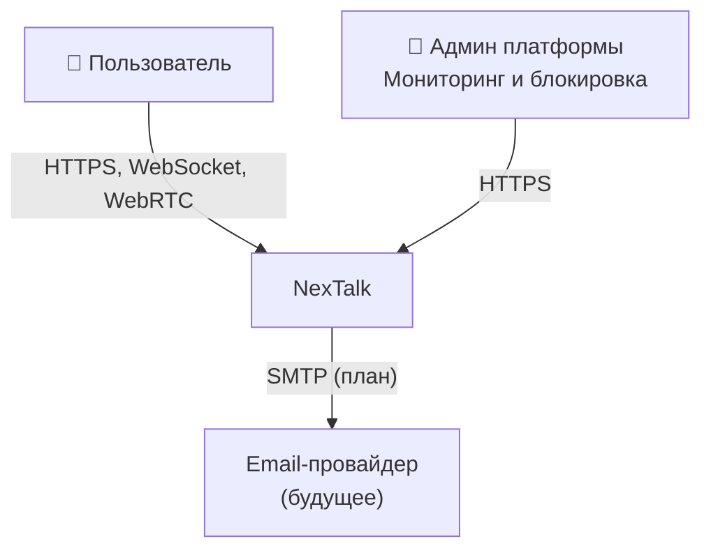
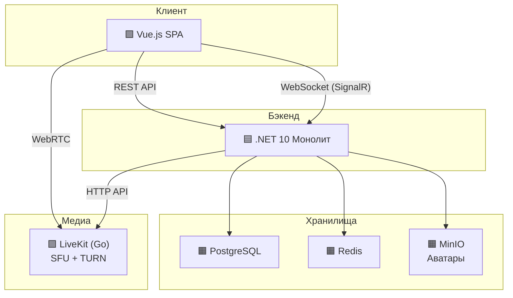

# NexTalk

Платформа для командного общения. Аналог Discord.

---

## Содержание

1. [Проблема и идея](#1-проблема-и-идея)
2. [MVP](#2-mvp)
3. [Пользователи и сценарии](#3-пользователи-и-сценарии)
4. [Архитектура](#4-архитектура)
5. [Модули системы](#5-модули-системы)
6. [Нефункциональные требования (NFR)](#6-нефункциональные-требования-nfr)
7. [Где хранятся данные](#7-где-хранятся-данные)
8. [Фронтенд](#8-фронтенд)
9. [План разработки по этапам](#9-план-разработки-по-этапам)
10. [За рамками MVP](#10-за-рамками-mvp-и-открытые-вопросы)
11. [Глоссарий](#11-глоссарий)

---

## 1. Проблема и идея

### Что это такое

NexTalk - это веб-платформа для общения, похожая на Discord: пользователи создают серверы, внутри серверов - текстовые и голосовые каналы, есть роли и права доступа.

**Ключевая особенность:** архитектура спроектирована с прицелом на end-to-end шифрование (E2EE). В MVP сообщения передаются plain text (защищены TLS), но модульная структура и схема хранения ключей готовы к внедрению E2EE в дальнейшем

### Для кого

Геймеры, удаленные команды, группы друзей - те, кому нужен общий голосовой и текстовый хаб с гарантией *конфиденциальности*.

---

## 2. MVP

### Входит в MVP

| Функция                          | Описание                                                          |
| :------------------------------- | :---------------------------------------------------------------- |
| **Регистрация и вход**           | Email + пароль. JWT-токены.                                       |
| **Серверы**                      | Создание, настройка ролей и прав доступа.                         |
| **Текстовые и голосовые каналы** | Создание каналов внутри сервера.                                  |
| **Текстовый чат**                | Отправка и получение сообщений в реальном времени (plain text).   |
| **Голосовые каналы**             | Разговор в реальном времени через браузер (WebRTC + LiveKit SFU). |
| **Онлайн-статусы**               | Видно, кто сейчас в сети (in-memory).                             |
| **Модерация**                    | Кик и бан участников с мгновенным отключением.                    |
| **Инвайт-ссылки**                | Простые ссылки для приглашения на сервер.                         |

### Не входит в MVP

Эти функции **не реализуются сейчас**, но архитектура не должна закрывать к ним дорогу:

- E2EE шифрование - спроектировано, будет в Фазе 2.
- Личные сообщения (DM) - API готово, UI в планах.
- Email-уведомления - Outbox Pattern готов, SMTP в планах.
- Вложения (файлы) - MinIO готово, UI в планах.
- Вход через Google / GitHub (OAuth).
- Push-уведомления.
- Мобильное приложение.
- Масштабирование на несколько серверов.

---

## 3. Пользователи и сценарии

### Роли

| Роль | Что может делать | Как получает роль |
|:--|:--|:--|
| **Владелец сервера** | Полный контроль: каналы, роли, удаление сервера | Создал сервер |
| **Администратор** | Управление каналами и ролями, модерация | Назначен владельцем |
| **Модератор** | Кик/бан в своих каналах, удаление сообщений | Назначен администратором |
| **Участник** | Писать сообщения, участвовать в голосовых каналах | Принял инвайт |
| **Админ платформы** | Мониторинг, блокировка пользователей/серверов | Технический доступ |

### Основные сценарии

**UC-1: Регистрация и вход.** Пользователь вводит email и пароль → система создает аккаунт и выдает токен доступа (JWT, см. [Глоссарий](#jwt-json-web-token))

**UC-2: Создание сервера.** Пользователь создает сервер, настраивает каналы и роли. Генерирует инвайт-ссылку.

**UC-3: Отправка сообщения.** Пользователь пишет текст → сервер сохраняет и рассылает онлайн-участникам через WebSocket.

**UC-4: Голосовой канал.** Пользователь нажимает "Войти" → браузер подключается к LiveKit → голос передается через WebRTC.

**UC-5: Модерация.** Администратор кикает/банит участника → мгновенное отключение от WebSocket и голосового канала.

**UC-6: Онлайн-статусы.** Браузер каждые 20 секунд отправляет heartbeat (см. [Глоссарий](#heartbeat)). Если heartbeat не пришел - через 30 секунд пользователь считается офлайн. Статусы видны только участникам общих серверов.

---

## 4. Архитектура

> **Подробная C4-модель с JSON для импорта в IcePanel** - в [C4-model.md](C4-model.md). Там же описаны Flows для основных сценариев и Component-диаграмма (.NET монолит, Level 3).

### Контекст системы (C4 Level 1)

Самый верхний уровень: кто взаимодействует с NexTalk и какие внешние системы задействованы.



| Элемент         | Что это                | Зачем нужен                                         |
| :-------------- | :--------------------- | :-------------------------------------------------- |
| Пользователь    | Человек в браузере     | Основной потребитель системы                        |
| Админ платформы | Технический специалист | Следит за работоспособностью, блокирует нарушителей |
| Email-провайдер | Внешний SMTP-сервис    | Шлет email-уведомления офлайн-пользователям         |

### Из чего состоит система (C4 Level 2)

Один уровень глубже: из каких запускаемых компонентов и хранилищ состоит NexTalk.



**6 компонентов для запуска** (все описываются в `docker-compose.yml`):

| Компонент        | Что это                                  | Зачем                                                     |
| ---------------- | ---------------------------------------- | --------------------------------------------------------- |
| **.NET монолит** | Один процесс со всеми модулями           | Вся бизнес-логика: авторизация, серверы, сообщения, голос |
| **PostgreSQL**   | Реляционная база данных                  | Постоянное хранение: пользователи, серверы, сообщения     |
| **Redis**        | In-memory хранилище                      | Временные данные: кто онлайн, кэш прав                    |
| **MinIO**        | S3-совместимое объектное хранилище       | Аватары пользователей                                     |
| **LiveKit**      | SFU-медиасервер на Go со встроенным TURN | Голосовые каналы: пересылка потоков, обход NAT            |
| **Vue.js SPA**   | Клиентское приложение в браузере         | Фронтенд: UI, WebSocket-клиент, голосовой клиент          |

Монолит состоит из **четырех бизнес-модулей** и двух вспомогательных слоев. Каждый модуль отвечает за свою область и не лезет напрямую в данные другого модуля.

---

## 5. Модули системы

### Identity - "Кто ты?"

**Отвечает за:** регистрацию, вход, токены, профили пользователей.

**Пример:** Маша регистрируется. Identity создает аккаунт, хеширует пароль, выдает JWT-токен.

**Почему отдельный модуль:** аутентификация и ключи - основа безопасности. Их смешивание с логикой серверов или сообщений усложнит контроль доступа к чувствительным данным.

### Guild - "Где ты общаешься?"

**Отвечает за:** серверы, каналы, роли и права доступа, инвайт-ссылки, модерацию (кик/бан).

**Пример:** Маша создает сервер "Курс", внутри - текстовый канал `#общий` и голосовой `Голос-1`. Она настраивает роль "Модератор" с правом кикать. Генерирует инвайт и отправляет Пете. Петя вступает с ролью "Участник".

**Почему отдельный модуль:** управление правами - сложная логика сама по себе. Ее используют все остальные модули: Messaging проверяет "может ли пользователь писать в этот канал", Voice - "может ли подключиться к голосу".

**Как работают права:** каждая роль хранит набор разрешений в виде числа - bitmask (см. [Глоссарий](#bitmask-битовая-маска)). Проверка - быстрая побитовая операция. Результат кэшируется в Redis.

> 📌 **Требует исследования:** конкретный набор permissions для bitmask.

### Messaging - "Что ты пишешь?"

**Отвечает за:** прием и хранение сообщений, историю.

**Почему отдельный модуль:** сообщения - самый нагруженный модуль. Отделение позволяет оптимизировать его независимо.

> 📌 **Требует исследования:** стратегия хранения истории (партиционирование таблиц).

### Voice - "Что ты говоришь?"

**Отвечает за:** голосовые сессии и WebRTC-сигналинг (обмен техническими данными для установки соединения).

**Почему отдельный модуль:** голос - принципиально другой тип трафика (real-time, UDP).

### WebSocket-слой - "Как доставляются события?"

Это **не бизнес-модуль**, а инфраструктурный слой. Управляет постоянными WebSocket-соединениями: кто подключен, кому что отправить. Здесь же живет логика онлайн-статусов: heartbeat каждые 20 секунд, запись в Redis с TTL.

**Пример:** Маша открыла NexTalk → браузер установил WebSocket → слой зарегистрировал "Маша онлайн". Когда Петя отправляет сообщение, WebSocket-слой находит всех онлайн-участников канала и рассылает blob.

### Фоновые сервисы - "Что происходит в тени?"

Это фоновые задачи **внутри того же .NET-процесса** (не отдельные программы):

1. **Outbox Relay** - читает таблицу `outbox_messages` из PostgreSQL и публикует события во внутреннюю очередь. Гарантирует, что событие не потеряется при сбое (см. [Глоссарий → Outbox Pattern](#outbox-pattern)).
2. **Notification Service** - читает события из очереди и отправляет email офлайн-пользователям. Уведомления содержат только метаданные (кто, куда, когда - без текста).

> **Почему не Kafka?** Для одного процесса с двумя фоновыми задачами достаточно встроенного механизма очередей. Kafka добавляет еще один компонент для деплоя и настройки. Если в будущем понадобится - интерфейс очереди заменяется без изменения бизнес-логики.


---

## 6. Нефункциональные требования (NFR)

|Код|Характеристика|Целевой уровень|Как достигается|
|---|---|---|---|
|**NFR-1**|Латентность доставки сообщения|**p95 < 100ms**|SignalR WebSocket, прямой broadcast|
|**NFR-2**|Качество голоса|Задержка **< 150ms**|LiveKit SFU, встроенный TURN|
|**NFR-3**|Доступность|**99%** (допустимы остановки на деплой)|Docker Compose, restart: unless-stopped|
|**NFR-4**|Безопасность передачи|TLS 1.3|HTTPS, WSS, DTLS (WebRTC)|
|**NFR-5**|Надежность доставки|At-least-once|Outbox Pattern|
|**NFR-6**|Производительность БД|Чтение истории < 200ms|Cursor pagination, индексы|
|**NFR-7**|Масштабируемость (будущее)|Архитектурная готовность|Модульный монолит, интерфейсы|
|**NFR-8**|Наблюдаемость|Health checks|/health endpoint для всех сервисов|
|**NFR-9**|Срок разработки|**4 недели**|Сокращенный scope, LiveKit вместо самописного SFU|
|**NFR-10**|Количество пользователей на демо|**10+ одновременных**|Достаточно для показа|

---

## 7. Где хранятся данные

### PostgreSQL - основное хранилище

Одна база данных, разделенная на **схемы** (schema) - по одной на модуль. Модуль работает только со своей схемой.

| Схема       | Что хранит                                      | Модуль    |
| :---------- | :---------------------------------------------- | :-------- |
| `identity`  | Пользователи, хеши паролей, токены, профили     | Identity  |
| `guild`     | Серверы, каналы, роли, участники, инвайты, баны | Guild     |
| `messaging` | Сообщения, outbox                               | Messaging |

> **Зачем разделять на схемы?** Чтобы модули не лезли в данные друг друга. Если модулю нужны чужие данные - он обращается через интерфейс модуля-владельца. Это правило критично, если в будущем нужно вынести модуль в отдельный сервис.

### Redis - быстрое временное хранилище

| Что хранит | Зачем |
|:--|:--|
| Онлайн-статусы | Heartbeat с TTL 30 сек - нет heartbeat = пользователь офлайн |
| Кэш прав доступа | Не ходить в PostgreSQL на каждую проверку прав |
| Голосовые сессии | Кто сейчас в каком голосовом канале |
| Rate limiting | Защита от спама: не более N запросов в секунду |

### MinIO - хранилище файлов

S3-совместимое объектное хранилище. Хранит аватары.

---

## 8. Фронтенд

### Технологии

| Технология                | Зачем                |
| ------------------------- | -------------------- |
| **Vue.js 3 + TypeScript** | UI-фреймворк         |
| **Pinia**                 | Состояние приложения |
| **SignalR**               | WebSocket-клиент     |
| **LiveKit Client SDK**    | Голосовые каналы     |
### Layout

```
+----------+------------------+-------------------------+-------------+
| Серверы  |  Каналы сервера  |      Чат / голос        |  Участники  |
| (иконки) |                  |                         |  онлайн     |
|          |  # общий         |  [сообщения]            |             |
|  [S1]    |  # новости       |  [сообщения]            |  🟢 Маша    |
|  [S2]    |                  |  [поле ввода]           |  ⚫ Петя    |
|          |  🔊 Голос-1      |                         |  ⚫ Коля    |
|  [+]     |  🔊 Голос-2      |                         |             |
+----------+------------------+-------------------------+-------------+
```

### Основные задачи

| Область           | Что делать                                                              |
| :---------------- | :---------------------------------------------------------------------- |
| Авторизация       | Страницы входа/регистрации. Автообновление токена.                      |
| Навигация         | Левая панель серверов, средняя - каналов. Бейдж непрочитанных.          |
| Чат               | Виртуальный скролл. Подгрузка истории.                                  |
| WebSocket         | Подключение при входе. Heartbeat 20 сек. Автопереподключение.           |
| Голос             | Вход/выход из канала. WebRTC. Mute/unmute. Индикатор говорящего.        |
| Статусы           | Цветные индикаторы у аватаров. Выбор своего статуса.                    |
| Администрирование | Роли и права. Инвайт-ссылки. Список участников с кик/бан.               |

### Что будет сложным

1. **E2EE в браузере** - Web Crypto API требует аккуратного управления ключами. Мало кто с этим работал, нужно время на изучение.
2. **Виртуальный скролл** - готовая библиотека, но интеграция с подгрузкой и расшифровкой нетривиальна.
3. **WebRTC signaling** - много состояний (offer → answer → ICE → connected), нужна state machine.
4. **Reconnect WebSocket** - при разрыве нужно запросить пропущенные сообщения.

---

## 9. План разработки по этапам

Проект разбит на **4 этапа** (~2 недели каждый). После каждого этапа - **работающая демо-версия**, которую можно показать.

> **Зачем делать по этапам?** Если оставить интеграцию на конец и что-то пойдет не так - показать будет нечего. Поэтому каждый этап дает рабочую систему, пусть с ограниченными возможностями.
>
> **Полный список задач** с описаниями, результатами и назначениями - в [tasks.md](tasks.md).

| Этап                                        | Срок       | Что работает                                                                                     | Как проверить                                        |
| :------------------------------------------ | :--------- | :----------------------------------------------------------------------------------------------- | :--------------------------------------------------- |
| **1. "Можно зайти и увидеть сервер"**       | Неделя 1–2 | Docker Compose поднимает все. Регистрация, логин, создание сервера и каналов. Layout в браузере. | `docker compose up` → регистрация → сервер виден     |
| **2. "Можно переписываться с шифрованием"** | Неделя 3–4 | WebSocket. Сообщения в реальном времени с E2EE. В БД - blob, в браузере - текст. Онлайн-статусы. | Два браузера → один пишет → другой видит → в БД blob |
| **3. "Можно созвониться и модерировать"**   | Неделя 5–6 | Голосовые каналы, mute, кик/бан с отключением, DM с E2EE.                                        | Голос вдвоем → mute → кик → DM                       |
| **4. "Стабильная демо-версия"**             | Неделя 7   | Все стабильно. Email-уведомления. Полный путь без ошибок.                                        | Полный сценарий + 10 пользователей                   |

Каждый этап - **по 5 задач на человека** (всего 80 задач, по 20 на каждого).

> **Про человеческий фактор.** Самые сложные задачи (WebSocket, E2EE, WebRTC) сознательно в середине, пока энергии достаточно. Последний этап - стабилизация и тесты: проще и привычнее.

---

## 10. За рамками MVP и открытые вопросы

### Не проектируем сейчас

Эти пункты существуют как ориентир. Архитектура не должна закрывать к ним дорогу, но **время на них не тратим**:

- OAuth (вход через Google/GitHub).
- Signal Protocol (продвинутое шифрование).
- Резервное копирование приватных ключей.
- Push-уведомления (FCM).
- Масштабирование (несколько инстансов, шардирование).
- Kafka (внешний брокер сообщений).
- Мобильное приложение.

### Открытые вопросы

Что нужно изучить до или во время реализации:

| Вопрос | Когда | Кто |
|:--|:--|:--|
| Web Crypto API: X25519 + AES-256-GCM в браузере | Этап 1 | Frontend 1 |
| mediasoup: HTTP API, создание комнат, участники | Этап 2 | Архитектор |
| Coturn: настройка TURN/STUN для NAT | Этап 2 | Архитектор |
| WebRTC signaling state machine | Этап 3 | Frontend 2 |
| Reconnect WebSocket + подгрузка пропущенного | Этап 2 | Frontend 1 |
| Ротация канальных ключей при бане | Этап 3 | Frontend 1 + Backend |
| Набор permissions для bitmask | Этап 2 | Архитектор |

---

## 11. Глоссарий

### E2EE (End-to-End Encryption)

Шифрование "от конца до конца". Данные шифруются на устройстве отправителя и расшифровываются только на устройстве получателя. Сервер посередине хранит зашифрованные данные и не может их прочитать - у него нет ключа.

### TLS (Transport Layer Security)

Шифрование "в дороге". Защищает данные при передаче между браузером и сервером (значок замка в адресной строке). Но на сервере данные расшифровываются - сервер их видит.

### Blob

Binary Large Object - большой объект из байтов. В NexTalk - зашифрованное сообщение: для сервера выглядит как бессмысленная последовательность байтов.

### JWT (JSON Web Token)

Токен авторизации. После логина сервер выдает подписанный "пропуск", который браузер прикладывает к каждому запросу. Сервер проверяет подпись и понимает, кто обращается, без повторного ввода пароля.

### WebSocket

Протокол двусторонней связи в реальном времени. В отличие от HTTP (спросил - получил ответ), WebSocket держит постоянное соединение: сервер может отправить данные клиенту в любой момент.

### WebRTC (Web Real-Time Communication)

Браузерная технология для передачи аудио и видео. Используется для голосовых каналов.

### SFU (Selective Forwarding Unit)

Тип медиасервера. Каждый участник отправляет один поток на SFU, SFU пересылает его остальным. Экономит трафик по сравнению с P2P. В отличие от MCU, **не декодирует** потоки - пересылает зашифрованные пакеты как есть.

### TURN / STUN

Протоколы для WebRTC. **STUN** определяет внешний IP-адрес за NAT. **TURN** ретранслирует трафик, если прямое соединение невозможно. Coturn - популярная реализация обоих.

### NAT (Network Address Translation)

Технология, из-за которой домашний компьютер не имеет "настоящего" IP в интернете (есть только внутренний, вроде 192.168.1.5). NAT затрудняет прямое соединение между компьютерами, поэтому WebRTC использует STUN/TURN.

### Модульный монолит (Modular Monolith)

Одно приложение (один процесс), внутри разделенное на модули с четкими границами. Проще микросервисов для маленькой команды, но при необходимости модуль можно вынести в отдельный сервис.

### Outbox Pattern

Паттерн надежной отправки событий. Событие записывается в таблицу `outbox_messages` в той же транзакции с бизнес-данными. Фоновый процесс читает таблицу и отправляет события. Гарантия: если данные записались - событие отправится.

### Bitmask (битовая маска)

Способ хранения набора разрешений в одном числе. Каждое разрешение - один бит. Проверка - быстрая побитовая операция.

### IndexedDB

Встроенная в браузер база данных для хранения данных на стороне клиента. В NexTalk хранит приватный ключ шифрования.

### Cursor-based Pagination

Загрузка данных порциями: "покажи 50 записей после этой конкретной записи". Работает быстро при любом объеме (в отличие от OFFSET).

### RBAC (Role-Based Access Control)

Управление доступом через роли. Пользователю не выдаются права напрямую - создаются роли с набором прав, пользователь получает роль.

### Heartbeat

Периодический сигнал "я жив" от клиента серверу (каждые 20 секунд). Если сигнал не приходит - сервер считает пользователя офлайн.
